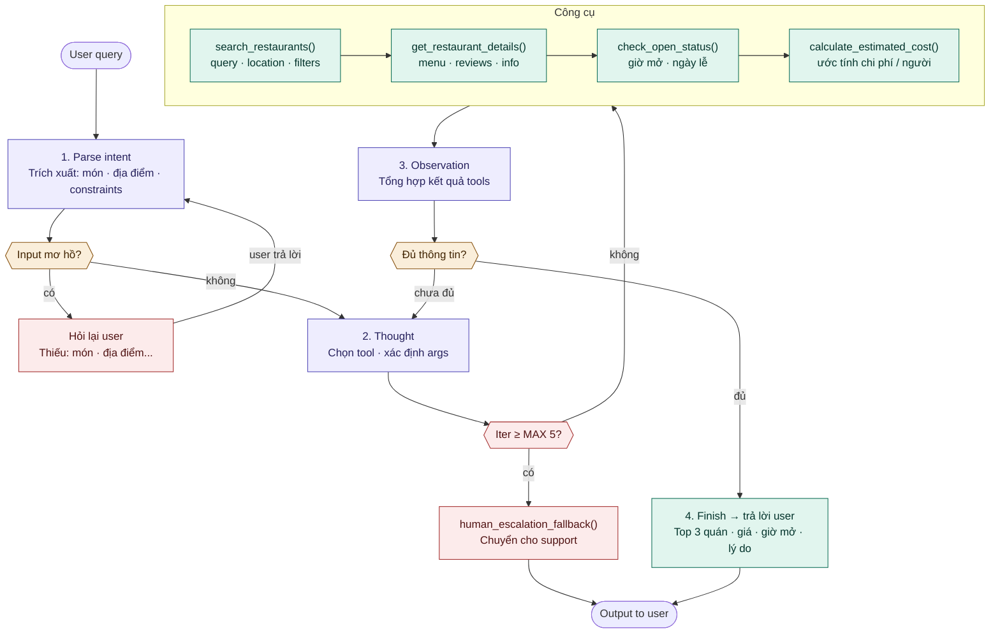

# Flowchart

```mermaid
flowchart TD
    START([User query]) --> PARSE

    PARSE["1. Parse intent\nTrích xuất: món · địa điểm · constraints"]:::react

    PARSE --> AMB{{"Input mơ hồ?"}}:::decision

    AMB -->|có| CLARIFY["Hỏi lại user\nThiếu: món · địa điểm..."]:::safeguard
    CLARIFY -->|user trả lời| PARSE

    AMB -->|không| THOUGHT

    THOUGHT["2. Thought\nChọn tool · xác định args"]:::react

    THOUGHT --> MAXITER{{"Iter ≥ MAX 5?"}}:::safeguard

    MAXITER -->|có| FALLBACK["human_escalation_fallback()\nChuyển cho support"]:::fallback
    FALLBACK --> OUT

    MAXITER -->|không| TOOLS

    subgraph TOOLS["Công cụ"]
        T1["search_restaurants()\nquery · location · filters"]:::tool
        T2["get_restaurant_details()\nmenu · reviews · info"]:::tool
        T3["check_open_status()\ngiờ mở · ngày lễ"]:::tool
        T4["calculate_estimated_cost()\nước tính chi phí / người"]:::tool
    end

    T1 --> T2
    T2 --> T3
    T3 --> T4

    TOOLS --> OBS["3. Observation\nTổng hợp kết quả tools"]:::react

    OBS --> INFO{{"Đủ thông tin?"}}:::decision

    INFO -->|chưa đủ| THOUGHT
    INFO -->|đủ| FINISH

    FINISH["4. Finish → trả lời user\nTop 3 quán · giá · giờ mở · lý do"]:::tool

    FINISH --> OUT([Output to user])

    classDef react fill:#EEEDFE,stroke:#534AB7,color:#26215C
    classDef tool fill:#E1F5EE,stroke:#0F6E56,color:#04342C
    classDef decision fill:#FAEEDA,stroke:#854F0B,color:#412402
    classDef safeguard fill:#FCEBEB,stroke:#A32D2D,color:#501313
    classDef fallback fill:#FCEBEB,stroke:#A32D2D,color:#501313

```
